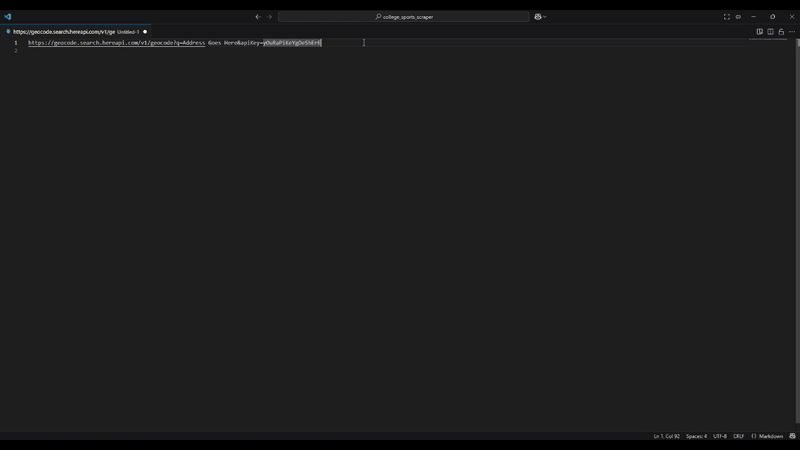

# URI Encode/Decode — VS Code Extension

Encode or decode URI/URL strings directly in the editor. Works on selections or the entire document, plus clipboard helpers.

## Features
- **Encode Selection / Decode Selection** — Operates on each selection (multi-cursor supported). If no selection, acts on the whole document.
- **Encode Entire Document / Decode Entire Document** — Explicit commands.
- **Clipboard Helpers** — Encode or decode the clipboard in place.
- Context menu items in the editor and handy default keybindings.



## Commands
- `URI Tools: Encode Selection` (`uri-tools.encodeSelection`)
- `URI Tools: Decode Selection` (`uri-tools.decodeSelection`)
- `URI Tools: Encode Entire Document` (`uri-tools.encodeDocument`)
- `URI Tools: Decode Entire Document` (`uri-tools.decodeDocument`)
- `URI Tools: Encode Clipboard` (`uri-tools.encodeClipboard`)
- `URI Tools: Decode Clipboard` (`uri-tools.decodeClipboard`)

## Default Keybindings
- Encode selection: `Ctrl+Alt+U` then `Ctrl+E`
- Decode selection: `Ctrl+Alt+U` then `Ctrl+D`
- When no selection: `Ctrl+Alt+U E` encodes document; `Ctrl+Alt+U D` decodes document

You can change these in **Preferences → Keyboard Shortcuts** by searching for "URI Tools".

## How it works
- Encoding uses JavaScript's `encodeURIComponent` to safely encode text.
- Decoding tries `decodeURIComponent` and falls back to `decodeURI` when appropriate.

## Requirements
- VS Code 1.84.0 or newer
- Node.js (for building/publishing)

## Build & Run (Local)
```bash
npm install
npm run watch
# Press F5 in VS Code to launch the Extension Development Host
```

## Package & Publish
1. Replace `"publisher": "your-publisher-id"` in `package.json` with your **Marketplace Publisher ID**.
2. Install `vsce` if needed: `npm i -g @vscode/vsce` (or use the local devDependency via `npx vsce`).
3. Sign in & create a Personal Access Token (PAT) per Marketplace docs.
4. Package:
   ```bash
   npm run compile
   npx vsce package
   ```
   This produces a `.vsix` you can share or install.
5. Publish:
   ```bash
   npx vsce publish
   ```

## Notes
- The extension operates in-place; undo with `Ctrl+Z` if needed.
- For query-string specific needs, consider modifying `encodeText`/`decodeText`.

## License
MIT
